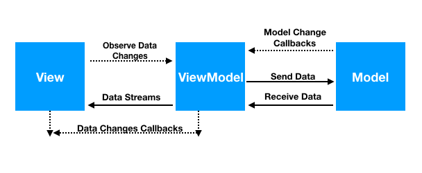

## Backend: 
* NodeJS(ExpressopreferiblementeNestJS)

## FrontEnd:
* VueJS(Vuetify preferiblemente)-
* React

## DEFINICIÓNDELAPRUEBATÉCNICA 
Desarrollar un proyecto de software básico de reserva(restaurante)el cual se dividen las funcionalidades en dos usuarios: ClienteyAdministrador .El clientetendrá la posibilidad de diligenciar un formulario básico con su información personal y datos de la reserva del lugar. El administrador será un usuario que puede acceder al módulo dashboard autenticandose mediante una página de login y tendrá la posibilidad de ver todas las reservas realizadas por los clientes. Acontinuación están los detalles funcionales de cada funcionalidad y su descripción Frontend y Backend:

* ArquitecturaBackend: Debe implementarse alguno de los lenguajes de programación definidos en los objetivos en su versión más reciente bajo una arquitectura de microservicios, definiendo entidades(esquema), modelos, capadenegocio (lógica).

* Arquitectura Base de datos: Para este proyecto debe implementarse PostgreSQL o MySQL definiendo un esquema relacional entre tres tablas(roles-usuarios-reservas).

 * Arquitectura Frontend: Debe implementarse alguno de los frameworks de frontend definidos en los objetivos Debe  implementarse una arquitectura que permita definir componentes,rutas de acceso,vistas y separar la lógica de la vista haciendo uso del patrón MVVM

 

